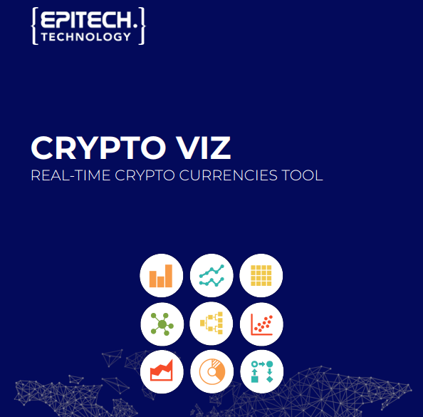

# Crypto viz - T-DAT-901

# Sommaire

- [Crypto Viz - T-DAT-901](#recommender---t-dat-901)
- [Sommaire](#sommaire)
- [Presentation](#presentation)
- [Technologies](#technologies)
- [Environnement](#environnement)
  - [Dates](#dates)
  - [Temps à disposition](#temps-à-disposition)
  - [Projets en parallèle](#projets-en-parallèle)
- [Fonctionnalités](#fonctionnalités)
- [Equipe et répartition du travail](#equipe-et-répartition-du-travail)
  - [Membres de l'équipe](#membres-de-léquipe)
- [Notation](#notation)
- [Liens](#liens)

# Presentation

Designing a game-changing ecosystem that will empower decision-makers with real-time cryptocurrency insights, achieved through continuous data scraping and lightning-fast analytics. The challenge lies in balancing speed and accuracy, ensuring up-to-the-minute data without sacrificing depth of analysis.

# Technologies
* Python, React.

# Environnement
Semestre 9 *(premier semestre de M2)*

## Dates
* **Début :** 2020-09-07
* **Fin :** 2021-02-28

## Temps à disposition
**Nombre total de jours :** 38 
*Detail :*
* *Nombre de jours par semaine en cours : 2*
* *Nombre de semaines alternées : 20*
* *Module Bizz day : -2 jours*

## Projets en parallèle 
* [T-ESP-900](https://github.com/plegulluche/T-ESP)
* [T-AIA-901](https://github.com/plegulluche/T-IAI-901)

# Fonctionnalités
* TODO

# Equipe et répartition du travail
**Nombre de commit total :** 1 
**Chef de projet :** Pierre Le gulluche 
**Documentation réalisée par :** Pierre Le gulluche 
**Diaporama de présentation réalisé par :** TBD

## Membres de l'équipe
* **Le Gulluche Pierre**
  * Nombre de commits : 1
  * Tâches implémentées :
    * Placeholder
    * Placeholder
    * Placeholder
* **Nabil Heddak**
  * Nombre de commits : 0
  * Tâches implémentées : -
* **Mathieu Blais & Abderaouf Hocine Bouklab**
  * Nombre de commits : 0
  * Tâches implémentées : -
* **Radu Gheorgiu**
  * Nombre de commits : 0
  * Tâches implémentées : -
* **Rafael Adragna**
  * Nombre de commits : 0
  * Tâches implémentées : -

  
# Liens
* [Projet](project)
